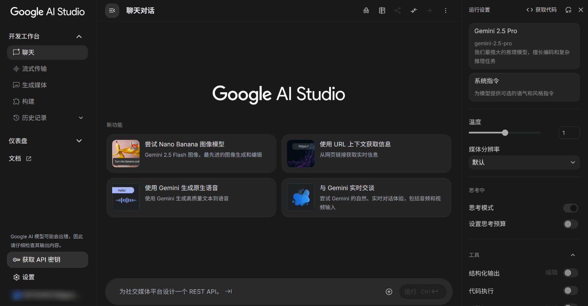
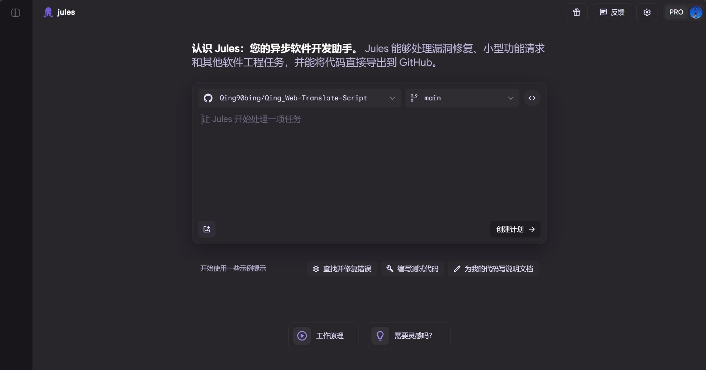

# [WEB 中文汉化脚本][github-project-link]

提升常用网站浏览体验，减少阅读压力 :)

<!-- SHIELD GROUP -->

[![GitHub stars][github-stars-shield]][github-stars-link]
[![GitHub issues][github-issues-shield]][github-issues-link]
[![GitHub forks][github-forks-shield]][github-forks-link]
[![License][license-shield]][github-license-link]

<kbd>目录</kbd>

- [🤔 这是什么？](#what-is-it)
- [✨ 主要特性](#features)
- [🖥️ 效果预览](#preview)
- [🚀 安装指南](#installation)
- [🤝 参与贡献](#contributing)
- [📝 待办事项](#todo)
- [🙏 特别致谢](#acknowledgements)
- [👨‍💻 作者声明](#author-declaration)
- [📜 许可证](#license)

## 🤔 这是什么？

“WEB 中文汉化脚本”是一个浏览器增强工具，它运行在 [油猴 (Tampermonkey)](https://www.tampermonkey.net/) 等脚本管理器之上

与浏览器自带的“整页翻译”不同，本脚本的每一句翻译都由社区人工贡献，翻译网站为中文，提升常用网站浏览体验，减少阅读压力

## ✨ 主要特性

- **🎯 精准翻译**：所有译文均由人工编写，保证术语准确、语境贴切
- **🚀 无缝体验**：内置“防闪烁”加载机制，在翻译应用前后，页面内容保持稳定，告别页面抖动和闪烁
- **🌐 智能适配**：脚本能自动检测浏览器语言并应用翻译，您也可以在油猴菜单中手动切换
- **🌍 社区驱动**：一个开放的项目，欢迎所有用户参与贡献，共同扩展和完善翻译库
- **🔧 开发者友好**：提供了简单易用的命令行工具，方便开发者检查、构建和管理翻译内容

## 🖥️ 效果预览

  <figure>
    <figcaption>Google AI Studio 汉化效果</figcaption>
    

      
    

  </figure>
   
  <figure>
    <figcaption>Jules 网站汉化效果</figcaption>
    

      
    

  </figure>

## 🚀 安装指南

在开始之前，您需要先安装一个用户脚本管理器

### 步骤 1: 安装脚本管理器

- **[Tampermonkey (篡改猴)](https://www.tampermonkey.net/)** 是目前最流行和推荐的选择。请根据您的浏览器（Chrome, Firefox, Edge 等）前往其官网进行安装
- **重要提示**: 对于 `Chrome / Chromium` 内核的浏览器，请确保在扩展程序管理页面 (`chrome://extensions`) 中开启“开发者模式”

### 步骤 2: 安装本脚本

提供两个版本供您选择：

| 版本 | 安装链接 | 描述 |
|:---:|:---:|:---|
| **CDN 版 (推荐)** | [**点击安装**](https://raw.githubusercontent.com/Qing90bing/Qing_Web-Translate-Script/main/dist/Web-Translate-Script.cdn.user.js) | **适合大多数用户**。通过 CDN 加载词典，脚本体积小，能更快地获取翻译更新 |
| **离线版** | [**点击安装**](https://raw.githubusercontent.com/Qing90bing/Qing_Web-Translate-Script/main/dist/Web-Translate-Script.user.js) | 将所有翻译词典内置于脚本中，适合网络不稳定或希望离线使用的场景 |

点击上方的“点击安装”链接，Tampermonkey 会自动弹出安装确认窗口，再次点击“安装”即可完成

> [!Note]**翻译更新**
>
> - 翻译更新不定期，本人还是学生，也需顾及学业，请您理解，谢谢:)

## 🤝 参与贡献

非常欢迎任何形式的贡献！无论是添加新网站的翻译、改进现有翻译，还是报告问题，都对项目意义重大

## 📝 待办事项

- 开发一个更友好的浏览器图形化管理和处理网站翻译文件界面
- 增加对更多网站的翻译支持

## 🙏 特别致谢

这个项目的实现离不开以下优秀的技术和资源，在此表示感谢：

### 运行环境

- [Tampermonkey](https://www.tampermonkey.net/)
- [Greasy Fork](https://greasyfork.org/)

### AI 助理

- [Jules](https://https://jules.google.com/)
- [Gemini](https://gemini.google.com/)

### 开发工具

- [Visual Studio Code](https://code.visualstudio.com/)
- [GitHub](https://github.com/)

### 核心依赖

- [esbuild](https://esbuild.github.io/)
- [inquirer](https://github.com/SBoudrias/Inquirer.js/)
- [acorn](https://github.com/acornjs/acorn)
- [Prettier](https://prettier.io/)

## 👨‍💻 作者声明

> [!TIP]
> 本人为计算机新手，该插件是全程在AI的协助下完成的。如果遇到bug，我会尽我所能去解决

## 📜 许可证

本项目采用 [MIT License](LICENSE) 开源协议

<!-- LINK GROUP -->
[github-project-link]: https://github.com/Qing90bing/Qing_Web-Translate-Script "项目"
[github-stars-shield]: https://img.shields.io/github/stars/Qing90bing/Qing_Web-Translate-Script?style=flat-square&logo=github&label=Stars
[github-stars-link]: https://github.com/Qing90bing/Qing_Web-Translate-Script/stargazers "星标"
[github-issues-shield]: https://img.shields.io/github/issues/Qing90bing/Qing_Web-Translate-Script?style=flat-square&logo=github&label=Issues
[github-issues-link]: https://github.com/Qing90bing/Qing_Web-Translate-Script/issues "议题"
[github-forks-shield]: https://img.shields.io/github/forks/Qing90bing/Qing_Web-Translate-Script?style=flat-square&logo=github&label=Forks
[github-forks-link]: https://github.com/Qing90bing/Qing_Web-Translate-Script/network "复刻"
[license-shield]: https://img.shields.io/github/license/Qing90bing/Qing_Web-Translate-Script?style=flat-square&logo=gitbook&label=License
[github-license-link]: https://github.com/Qing90bing/Qing_Web-Translate-Script/blob/main/LICENSE "许可证"

    

